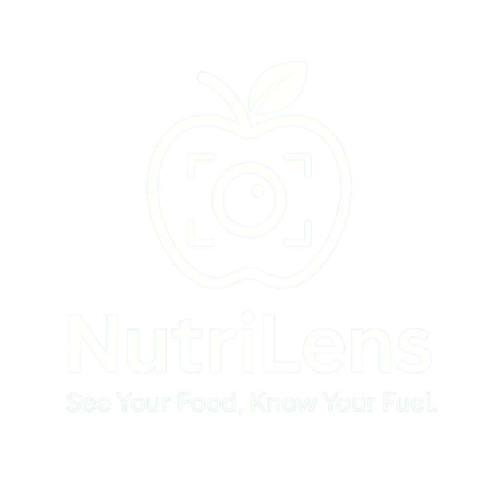

# Nutrilens - AI Nutrition Tracker
 See Your Food, Know Your Fuel
 


A comprehensive nutrition tracking application with AI-powered food analysis and logging capabilities.

## Key Features

- **AI Food Recognition** - Scan food images for instant nutrition analysis (Note: Indian cuisine recognition is currently under development and may be less accurate than Western food items)
- **Dashboard** - Track meals, calories, and macronutrients
- **Image Scanning** - Log meals by taking photos
- **Calorie Tracking** - Monitor daily intake and goals
- **Responsive Design** - Works on all devices
- **Secure Authentication** - Firebase-powered user accounts

## Technologies Used

- Next.js 14 (App Router)
- React 18
- TypeScript
- Firebase (Authentication & Firestore)
- Tailwind CSS
- Shadcn UI components
- Nutrition Analysis API

## Getting Started

1. Clone the repository
   ```bash
   git clone https://github.com/Aryangaikwadsql/nutrilens-app.git
   ```
2. Install dependencies
   ```bash
   pnpm install
   ```
3. Set up environment variables
   ```bash
   cp .env.example .env.local
   ```
4. Run development server
   ```bash
   pnpm dev
   ```

## License

MIT
